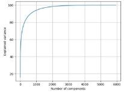
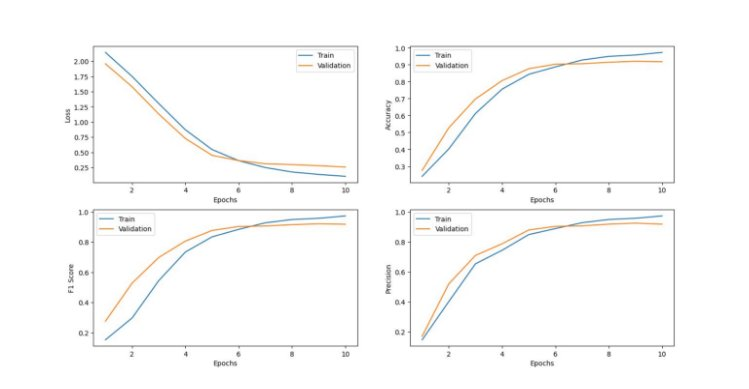

### Introduction

This project proposes the development of a classification model to classify images from [Clothing Dataset Small](https://github.com/alexeygrigorev/clothing-dataset-small). The application will be designed to assist fashion retailers, fashion enthusiasts, and fashion analysts in various scenarios. The successful completion of this project will contribute to the development of visual search engines for fashion items and the improvement of inventory management systems in the fashion industry.

### Use Cases

The application can be used in various scenarios, including but not limited to:

- Recommending similar clothing items based on the user's preferences
- Identifying fashion trends and analysing the demand for specific types of clothing
- Classifying images for inventory management purposes in retail stores
- Assisting with the product search functionality on e-commerce websites
- Improving the quality of visual search engines for fashion items

### Data Understanding

The dataset consists of various coloured images of fashion items of different sizes. There are 10 possible labels for the images: Dress, Hat, Long Sleeve, Outwear, Pants, Shirts, Shoes, Shorts, Skirt, T-shirt. Below shows the distribution of our dataset. This dataset has already been grouped into train, test and validation.

 

*Figure 1: Data distribution in Clothing Dataset Small*

Observations

1) The dataset is imbalanced - heavily skewed towards the number of T-shirts.
1) Since we are dealing with image classification, we expect the number of dimensions for each instance to likely be high.
1) The type of clothing is largely defined by their outlines/shape. However, there are some classes with similar shapes (eg. outwear and tshirts). Finer features on the clothing such as texture and colour intensity may be required to correctly classify some instances.

### Experimentation

**Data Extraction + Preprocessing**

**Data Augmentation**

To mitigate the data imbalance, we considered resampling methods to even out the data. Since our dataset is already small, we decided to oversample rather than undersample. Since we observe that the images were mostly symmetrical about their horizontal axis, we augmented the dataset by flipping all non T-shirt images about their horizontal axis. We also combined the train and validation folders so that we can conduct cross validation rather than rely on only 1 validation set. We then experimented on different models using the 5 features listed below.

**Feature Set 1: Resized, flattened grayscale image**

To process the data for the initial set of experiments, we re-sized the dimensions of each image to 64 x 64 and converted them to grayscale. The resizing helps to reduce the number of dimensions needed to be processed by our classifiers later. The grayscale was achieved by taking the average pixel intensity of each pixel in the RGB channels and converting them into a single value from 0 - 255. After which, we flattened the 2D 64 x 64 image into a 1D array of size 1 x 4096, where each column acts as a feature variable.

**Feature Set 2: Object’s shape**

We also used edge operators to extract the object’s shape from the image using the prewitt function in sklearn. Edge operators are discrete differentiation operators, which compute an approximation of the gradient of the image intensity function. It allows us to determine the outline of the objects in our clothing images for classification

**Feature Set 3: Combining object’s shape and Grayscale pixel values**

We concatenated the edge operator and the grayscale pixel values to be used as feature variables.

**Feature Set 4: Histogram of Oriented Gradients (HOG)**

We experimented using the histogram of oriented gradients method as feature variables. The HOG descriptor focuses on the structure or the shape of an object. This differs from edge operators, as there we only identify if the pixel is an edge or not. HOG is able to provide the edge direction as well, allowing us to also identify finer features on the clothing images. This is done by extracting the gradient and orientation of the edges.

We will first read the image as grayscale, before resizing the image into 64 x 128, using cv resize. This is because the [original paper](https://lear.inrialpes.fr/people/triggs/pubs/Dalal-cvpr05.pdf) by Dalal and Triggs found that 64×128 is the ideal image size, although any image size that has the ratio 1:2 can be used. Our hyperparameters for HOG were set based on a tutorial [here](https://www.analyticsvidhya.com/blog/2019/09/feature-engineering-images-introduction-hog-feature-descriptor/). We set the orientations to 9 to utilize a 9 x 1 matrix, and set the pixels\_per\_cell for the histogram as 8 x 8 cells. We also set cells\_per\_block which is the size of the block over which we normalize the histogram as 2 x 2.

**Feature Set 5: Scale-Invariant Feature Transform (SIFT)**

The SIFT algorithm is used to detect and describe local features in images, which can be helpful for tasks like object recognition and matching.

This was done by using OpenCV's imread function, which loads the image in grayscale format. After loading the image, the SIFT algorithm is applied using cv.SIFT\_create() to create a SIFT object, and the detectAndCompute function is used to find the keypoints and descriptors of the image. The keypoints are then drawn on the image using the cv.drawKeypoints function, which creates a new image with the keypoints overlaid on the original image. Finally, the new image with keypoints is saved using OpenCV's imwrite function.

SIFT descriptors generated by the algorithm are variable in size, which makes them difficult to use directly in many machine learning algorithms. Bag of Visual Words (BoVW) is used to create fixed-size vectors representing the images. The KMeans clustering algorithm is applied to the SIFT descriptors to create a visual vocabulary, and histograms are created for each image using the vocabulary.

**Principal Component Analysis (PCA)**

Due to the high dimensionality of our data, we expected dimensionality reduction to be important in helping remove noise variables. As such, we experimented with PCA. For the hyperparameter tuning, we checked the explained variance against the number of components and obtained the following:

*Figure 2: Graph of explained variance vs number of components*

From figure 2, we can see that many of the components do not give a significant increase in explained variance, for example, removing 5192 components allowed us to still maintain 99.5% of the explained variance. Therefore, dimensionality reduction to a certain aspect would not cause significant loss in data.

We then experimented with several different values of n\_components: [0.7, 0.75, 0.8, 0.85, 0.9, 0.95, 0.99] and listed the best values of the hyperparameter for each model.

**Linear Discriminant Analysis (LDA)**

We also experimented with LDA for feature reduction. We experimented with the different hyperparameters, solver and shrinkage for all the different models listed below and listed the best values of the hyperparameters for each model.

### Performance Criteria

F1 Micro Score: We felt that precision and recall were both equally important in our project context, so we decided to use the harmonic mean of them as the metric for our experiments. Also, since the dataset we trained on is imbalanced, we decided to use F1 micro rather than F1 macro.

### Baseline Models

**K-Nearest Neighbours (KNN)**

Hyperparameter tuning: We set the range of possible k values from 2 to 100 and exhaustively searched for the optimal hyperparameter. These values were chosen by taking into consideration the square root of our number of samples ≈ 54, which we expect the optimal hyperparameter to lie close to.

*Table 1: Results of KNN on various features*

|Features|Best Hyperparameters|Best Training Results (Randomised Search Cross Validation)|Test Results|
| - | - | :- | - |
|Grayscale|n\_neighbors = 2|53\.20%|34\.40%|
|Edges|n\_neighbors = 2|45\.15%|31\.36%|
|Grayscale + Edges|n\_neighbors = 2|55\.12%|34\.54%|
|PCA on Grayscale + Edges|n\_neighbors = 2, n\_components = 0.75|64\.71%|32\.37%|
|LDA on Grayscale + Edges|n\_neighbors = 2 shrinkage= 0.6|84\.63%|41\.91%|
|**HOG**|**n\_neighbors = 2**|**58.90%**|**44.65%**|
|SIFT|n\_neighbors = 5|52\.54%|13\.73%|

**Decision Tree (DT)**

Hyperparameter tuning: Similar to KNN, we set the range of maximum depths from 2 to 100 and exhaustively searched for the best hyperparameter.

*Table 2: Results of DT on various features*

|Features|Best Hyperparameters|Best Training Results (Randomised Search Cross Validation)|Test Results|
| - | - | :- | - |
|Grayscale|max\_depth = 12|36\.80%|32\.66%|
|Edges|max\_depth = 12|27\.20%|23\.70%|
|Grayscale + Edges|max\_depth = 42|34\.67%|30\.06%|
|PCA on Grayscale + Edges|max\_depth = 96, n\_components = 0.75|51\.89%|30\.06%|
|**LDA on Grayscale + Edges**|**max\_depth = 86, shrinkage = 0.6**|**80.06%**|**41.33%**|
|HOG|max\_depth = 12|33\.24%|31\.50%|
|SIFT|max\_depth = 83|26\.76%|16\.33%|

The best baseline model we could produce was KNN with k = 24 using LDA on Grayscale + Edges as our feature variable. It obtained a test F1 score of 44.65%.

### Experiments to find improved models

**Support Vector Machine (SVM)**

SVM has shown to be able to [produce decent results](https://www.sciencedirect.com/science/article/abs/pii/S0167865520302981) for image classification. We used SGDClassifier to build our SVM model, tuning the loss function, penalty, and alpha value (which affects learning rate). We used the following hyperparameter grid:

svm\_param\_grid = {‘svm\_\_alpha’: uniform(loc = 0, scale = 0.01), ‘svm\_\_loss’: [‘hinge’, ‘squared\_hinge’], ‘svm\_\_penalty’: [‘12’, ‘11’, ‘elasticnet’]}

For each combination of hyperparameters, we conducted 5-fold cross validation on the training data and calculated F1 scores. We then picked the best performing set of hyperparameters to experiment on the test dataset.

*Table 3: Results of SVM on various features*

|Features|Best Hyperparameters (alpha, loss, penalty)|Best Training Results (Randomised Search Cross Validation)|Test Results|
|PCA on HOG|(0.0030461376917337067, 'hinge', l1)|57\.33%|56\.93%|
|**LDA on HOG**|**(0.002747217929900642, 'hinge', 'l2')**|**83.49%**|**60.84%**|
|HOG|(0.003745401188473625, 'hinge', 'elasticnet')|61\.86%|56\.94%|
|SIFT|(0.007319939418114051, 'hinge', 'l2')|23\.09%|19\.51%|

LDA + HOG feature + SVM produced decent test F1 scores of 60.84% compared to baseline models. **Random Forest (RF)**

Besides SVM, RF is another traditional algorithm [widely used for image classification problems](https://sciendo.com/pdf/10.2478/ftee-2022-0046). We tested if it was feasible to be used for clothing classification. Below shows the hyperparameters that we have tried to tune.

rf\_param\_grid = {‘n\_estimators’: [10, 50, 100, 200], ‘max\_depth’: list(range(2, 100)), ‘min\_samples\_split’: [2,5,10], ‘min\_samples\_leaf’: [1,2,4], ‘max\_features’: [‘auto’, ‘sqrt’, ‘log2’]}

Due to the large number of possible combinations, we first limited the search space of the RF classifier to reasonable values and randomly chose combinations of hyperparameters to be tested. For each experiment, 5-fold cross validation was conducted. The best set of performing hyperparameters for each feature was tested on the test dataset.

*Table 4: Results of RF on various features*

|Features|
Best Hyperparameters

(n\_estimators, min\_samples\_split, min\_samples\_leaf,

max\_features,

max\_depth)

[PCA/LDA hyperparameters]
|Best Training Results (Randomised Search Cross Validation)|Test Results|
|PCA on Grayscale + Edges|(200, 5,1, 'max\_features': 'sqrt', 74) [n\_components = 0.99]|38\.79%|31\.80%|
|LDA on Grayscale + Edges|50, 2, 1, 'sqrt', 89, [shrinkage = 0.8]|89\.03%|44\.36%|
|PCA on HOG|(100, 5, 2, 'log2', 77) [n\_components = 0.7]|73\.33%|28\.90%|
|**LDA on HOG**|**(50, 2, 1, 'sqrt',58) [shrinkage = 0.5]**|**86.82%**|**65.90%**|
|HOG|(200, 5, 1, ‘sqrt’, 74)|57\.91%|48\.84%|
|SIFT|(200, 5, 1, ‘sqrt’, 74)|43\.79%|22\.25%|

Our RF model was also able to produce better test F1 scores than our baseline models. **Convolutional Neural Network (CNN)**

Besides experimenting with traditional algorithms, we also tried using deep learning for our image classification problem, as suggested by the research papers that were previously linked. Hyperparameters we tuned were:

1. Epoch: The number of complete iterations through the entire training dataset. During each epoch, the model trains on all the available training data, updates the weights and biases of the neural network, and evaluates the performance on the validation set.
1. Batch size: The number of training examples that are processed in a single forward/backward pass of the neural network during training. The entire training dataset is usually too large to be processed at once, so it is divided into smaller batches. The model updates the weights and biases after each batch.
1. Kernel size: Defines the size of the convolution window.
1. Pool size: The size of the pooling window. Pooling is a process of down-sampling the feature maps produced by convolutional layers.

*Table 5: Results of CNN and hyperparameters tuned*

<table><tr><th colspan="1" valign="top">Hyperparameters Tested</th><th colspan="1" valign="top">Tested Hyperparameters</th><th colspan="1" valign="top">Best Hyperparameters</th><th colspan="1" valign="top">Test F1 score</th></tr>
<tr><td colspan="1">Epochs</td><td colspan="1">[10, 20, 30]</td><td colspan="1">30</td><td colspan="1" rowspan="4" valign="top"><b>75.42%</b></td></tr>
<tr><td colspan="1">Batch Size</td><td colspan="1">[8, 16, 32]</td><td colspan="1">32</td></tr>
<tr><td colspan="1">Kernel Size</td><td colspan="1">[(3, 3), (5, 5), (7, 7)]</td><td colspan="1">(5, 5)</td></tr>
<tr><td colspan="1">Pool Size</td><td colspan="1">[(2, 2), (3, 3)]</td><td colspan="1">(2, 2)</td></tr>
</table>

*Figure 3: Results of CNN on test dataset*

The testing f1 micro for CNN is high on 0.7542, in comparison with K-Nearest Neighbours (0.4465), Decision Tree (0.4133), Support Vector Machines (0.6084), and Random Forest (0.6590), we found that CNN performs slightly better. To obtain even better results, we will continue in the next section to try the State-of-the-Art (SOTA) Model, in pursuit of better test results.

 

*Figure 4: F1 micro score and loss as the number of epochs increases for CNN*

### State Of The Art (SOTA) Model

**Residual Neural Network (ResNet)**

While searching for SOTA Models, we decided on going with ResNet as it is the [go to model for image classification](https://www.cv-foundation.org/openaccess/content_cvpr_2016/papers/He_Deep_Residual_Learning_CVPR_2016_paper.pdf) and object detection. It functions by using residual connections or skip connections to help overcome the problem of vanishing gradients in deep neural networks and we thought that this would be a good fit for our image dataset.

We used our augmented dataset with the train, validation and test sets to train the model as the feature extracted data as fine-tuning the ResNet model on our dataset was seen to be more effective than using feature-extracted data. This is because fine-tuning allows the model to learn task-specific features that may not be captured by the pre-trained model.

*Table 6: Results of ResNet and hyperparameters tuned*

<table><tr><th colspan="1" valign="top">Hyperparameters Tested</th><th colspan="1" valign="top">Tested Hyperparameters</th><th colspan="1" valign="top">Best Hyperparameters</th><th colspan="1" valign="top">Test Results (Test Set)</th></tr>
<tr><td colspan="1" valign="top">Batch Size</td><td colspan="1" valign="top">[32, 64]</td><td colspan="1" valign="top">32</td><td colspan="1" rowspan="5" valign="top"><b>94.22%</b></td></tr>
<tr><td colspan="1" valign="top">Learning Rate</td><td colspan="1" valign="top">[0.01, 0.001, 0.0001]</td><td colspan="1" valign="top">0\.0001</td></tr>
<tr><td colspan="1">Momentum</td><td colspan="1">[0.5, 0.9, 0.99]</td><td colspan="1">0\.99</td></tr>
<tr><td colspan="1">Weight Decay</td><td colspan="1">[1e-4, 1e-3, 1e-5]</td><td colspan="1">1e-05</td></tr>
<tr><td colspan="1">Epochs</td><td colspan="1">[10, 15]</td><td colspan="1">10</td></tr>
</table>
*Figure 5: Training Results for ResNet (Train and Validation Set)*

Analysis

After training the model we achieved a test accuracy of 94.22% which is significantly higher than the other models used so far. This high accuracy can be attributed to several factors that make the ResNet model particularly effective for image classification. One key aspect is the use of residual connections, which allow information to flow through the network more easily and prevent the vanishing gradient problem that can occur with deep neural networks. By adding skip connections that bypass several layers in the network, ResNet models are able to preserve the information learned in earlier layers and ensure that it is available to later layers, making the model more efficient and effective.

Another factor contributing to the success of the ResNet model is the use of batch normalisation, which helps to reduce the internal covariate shift problem and makes training more stable. By normalising the input to each layer, batch normalisation can speed up the training process and improve the overall accuracy of the model.

Finally, the ResNet model also benefits from the use of deep convolutional layers, which are able to learn increasingly complex features from the input data. By stacking multiple convolutional layers together, the model can learn to recognize high-level features such as shapes, textures, and patterns that are essential for accurate image classification.

Overall, the ResNet model outperforms the other models by a wide margin and its success can be attributed to a combination of innovative architectural features and effective training techniques.

Other Considerations

There were a few other hyperparameters we could have tuned such as Dropout Rates, Activation functions, Layers, and the type of Optimizer used, but due to long training times and time constraints we could not test everything.

**References**

* Clothing Dataset Small: [alexeygrigorev/clothing-dataset-small: Clothing dataset, 10 classes (github.com)](https://github.com/alexeygrigorev/clothing-dataset-small)

* Histogram of Oriented Gradients: [HOG (Histogram of Oriented Gradients): An Overview | by Mrinal Tyagi | Towards Data Science](https://towardsdatascience.com/hog-histogram-of-oriented-gradients-67ecd887675f)

* [Dalal-cvpr05.pdf (inrialpes.fr)](https://lear.inrialpes.fr/people/triggs/pubs/Dalal-cvpr05.pdf)

* [Feature Descriptor | Hog Descriptor Tutorial (analyticsvidhya.com)](https://www.analyticsvidhya.com/blog/2019/09/feature-engineering-images-introduction-hog-feature-descriptor/)

* Scale-Invariant Feature Transform: [Introduction to SIFT( Scale Invariant Feature Transform) | by Deepanshu Tyagi | Data Breach | Medium](https://medium.com/data-breach/introduction-to-sift-scale-invariant-feature-transform-65d7f3a72d40)

* [SIFT Algorithm | How to Use SIFT for Image Matching in Python (analyticsvidhya.com)](https://www.analyticsvidhya.com/blog/2019/10/detailed-guide-powerful-sift-technique-image-matching-python/)

* Choosing Improved Models: [ftee-2022-0046 (sciendo.com)](https://sciendo.com/pdf/10.2478/ftee-2022-0046)

* [Comparative analysis of image classification algorithms based on traditional machine learning and deep learning - ScienceDirect](https://www.sciencedirect.com/science/article/abs/pii/S0167865520302981)

* Support Vector Machines: [sklearn.linear_model.SGDClassifier — scikit-learn 1.2.2 documentation](https://scikit-learn.org/stable/modules/generated/sklearn.linear_model.SGDClassifier.html)

* [Fighting Overfitting With L1 or L2 Regularization: Which One Is Better? - neptune.ai ](https://neptune.ai/blog/fighting-overfitting-with-l1-or-l2-regularization#:~:text=The%20differences%20between%20L1%20and,regularization%20solution%20is%20non%2Dsparse.)<https://www.sciencedirect.com/science/article/abs/pii/S0167865520302981>

* Random Forest: [sklearn.ensemble.RandomForestClassifier — scikit-learn 1.2.2 documentation](https://scikit-learn.org/stable/modules/generated/sklearn.ensemble.RandomForestClassifier.html)

* [Understanding Random Forest. How the Algorithm Works and Why it Is… | by Tony Yiu | Towards Data Science ](https://towardsdatascience.com/understanding-random-forest-58381e0602d2)Convolutional Neural Network: 

* [Convolutional Neural Network (CNN) | TensorFlow Core](https://www.tensorflow.org/tutorials/images/cnn)

* Residual Neural Network: [ResNet | PyTorch](https://pytorch.org/hub/pytorch_vision_resnet/)

* [\[1512.03385\] Deep Residual Learning for Image Recognition (arxiv.org)](https://arxiv.org/abs/1512.03385)

* [Deep Residual Learning for Image Recognition (cv-foundation.org)](https://www.cv-foundation.org/openaccess/content_cvpr_2016/papers/He_Deep_Residual_Learning_CVPR_2016_paper.pdf)

### Written by:
* Marcus Tang Xin Kye (A0217934Y) 
* Taufiq Bin Abdul Rahman(A0218081L) 
* Tay Yan Han (A0216335L)
* Ong Jun Xiong (A0214943E)
* See Jian Hui (A0217701N) 
* Madhan Selvapandian (A0218446B)

